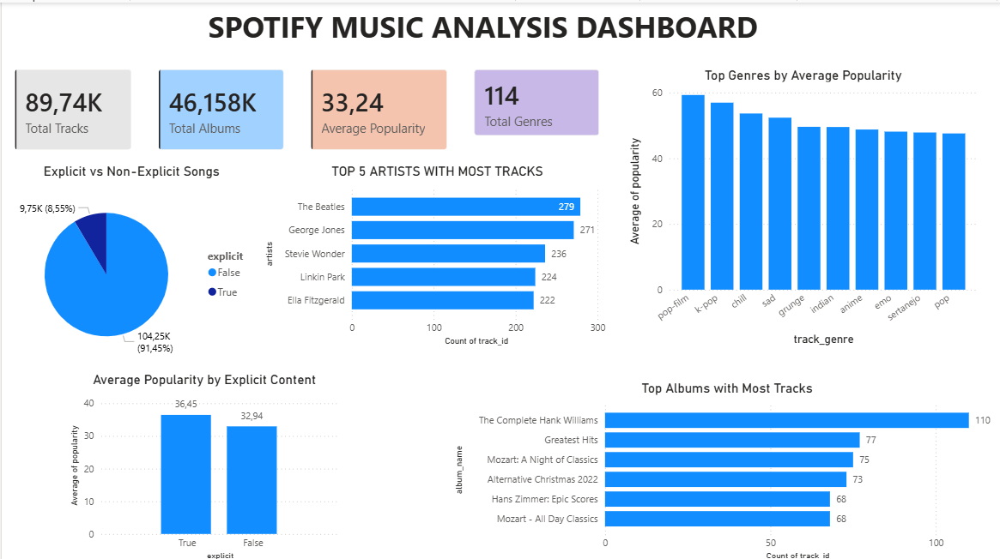

# 📊 Spotify Analytics Project

---

## 🧠 Overview

This is a dataset of Spotify tracks across 125 different genres. Each track contains multiple audio features such as popularity, energy, danceability, and explicit content.

The dataset is stored in CSV format and can be easily loaded and analyzed using Python and SQL.

The main objective of this project is to analyze music trends, identify popular genres and artists, and explore relationships between audio features using data visualization and dashboards.

---

## 🛠 Tools Used

- Python (Pandas, Matplotlib)
- SQL (MySQL)
- Power BI
- Jupyter Notebook

---

## 🔄 Workflow

1. Load dataset from CSV using Python (Pandas)
2. Data cleaning and preprocessing
3. Load cleaned data into MySQL database
4. Perform SQL analysis (GROUP BY, COUNT, AVG, DISTINCT)
5. Data visualization using Python
6. Build interactive dashboard using Power BI

---

## 📊 Dashboard Screenshot

## 🔍 Insights

### 1. Most Popular Genres

The genres with the highest average popularity are:

- pop-film  
- k-pop  
- chill  
- sad  

Among them, **pop-film** has the highest average popularity, followed by **k-pop**. This indicates that listeners tend to prefer these genres more than others.

---

### 2. Explicit vs Non-Explicit Analysis

Non-explicit songs account for the majority of the dataset, while explicit songs represent only a small portion.

However, explicit songs show a higher average popularity:

- Explicit (True): 36.45  
- Non-Explicit (False): 32.94  

This suggests that explicit songs tend to attract more listener engagement.

---

### 3. Top 5 Artists with Most Tracks

Some artists contribute a significantly larger number of tracks in the dataset. These artists make up a large portion of the Spotify catalog and appear more frequently compared to others.

---

### 4. Top 5 Albums with Most Tracks

The albums with the highest number of tracks include:

- The Complete Hank Williams  
- Greatest Hits  
- Mozart: A Night of Classics  

Among them, **The Complete Hank Williams** contains the highest number of tracks in the dataset.

---

### 5. Dataset Overview

The Spotify dataset includes:

- ~89.74K tracks  
- ~46.15K albums  
- 114 genres  
- Average popularity: 33.24  

This shows that the dataset is large-scale and covers a wide variety of music genres.
